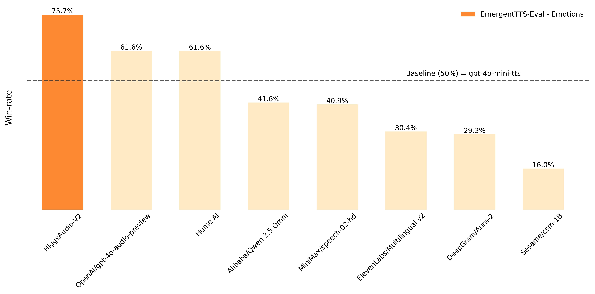
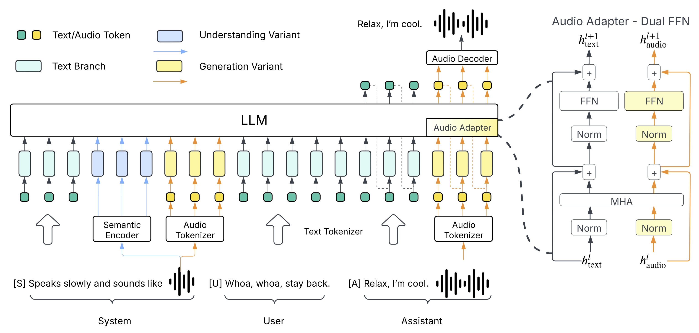
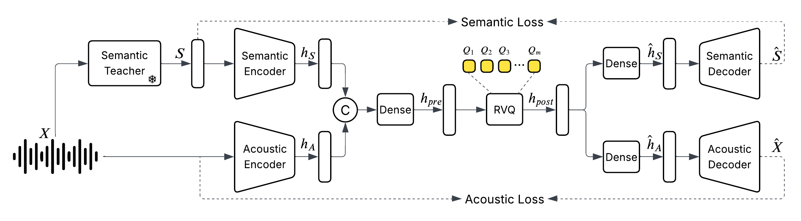

# Higgs Audio V2: Redefining Expressiveness in Audio Generation

<div align="center" style="display: flex; justify-content: center; margin-top: 10px; flex-wrap: wrap; gap: 8px;">
  <a href="https://boson.ai/blog/higgs-audio-v2"></a>
  <a href="https://github.com/boson-ai/higgs-audio"></a>
  <a href="https://huggingface.co/spaces/smola/higgs_audio_v2"></a>
  <a href="https://huggingface.co/bosonai/higgs-audio-v2-tokenizer"></a>
</div>

Check our open-source repository https://github.com/boson-ai/higgs-audio for more details!

We are open-sourcing Higgs Audio v2, a powerful audio foundation model pretrained on over 10 million hours of audio data and a diverse set of text data.
Despite having no post-training or fine-tuning, Higgs Audio v2 excels in expressive audio generation, thanks to its deep language and acoustic understanding.

On [EmergentTTS-Eval](https://github.com/boson-ai/emergenttts-eval-public), the model achieves win rates of **75.7%** and **55.7%** over "gpt-4o-mini-tts" on the "Emotions" and "Questions" categories, respectively. It also obtains state-of-the-art performance on traditional TTS benchmarks like Seed-TTS Eval and Emotional Speech Dataset (ESD). Moreover, the model demonstrates capabilities rarely seen in previous systems, including automatic prosody adaptation during narration, zero-shot generation of natural multi-speaker dialogues in multiple languages, melodic humming with the cloned voice, and simultaneous generation of speech and background music.


<p>
    
</p>

Here's the demo video that shows some of its emergent capabilities (remember to unmute):

<div align="left">
    <video width="95%" controls>
        <source src="https://cdn-uploads.huggingface.co/production/uploads/64fa072a52e82dd432460767/bjbWGg1IKoMtWXnl0Od8G.mp4" type="video/mp4">
        Your browser does not support the video tag.
    </video>
</div>

Here's another demo video that show-cases the model's multilingual capability and how it enabled live translation (remember to unmute):

<div align="left">
    <video width="95%" controls>
        <source src="https://cdn-uploads.huggingface.co/production/uploads/64fa072a52e82dd432460767/9cN-ky02GzmUgogsIh1Wg.mp4" type="video/mp4">
        Your browser does not support the video tag.
    </video>
</div>

## Technical Details

<p>
    
</p>

Higgs Audio v2 adopts the "generation variant" depicted in the architecture figure above. Its strong performance is driven by three key technical innovations:

- We developed an automated annotation pipeline that leverages multiple ASR models, sound event classification models, and our in-house audio understanding model. Using this pipeline, we cleaned and annotated 10 million hours audio data, which we refer to as AudioVerse. The in-house understanding model is finetuned on top of Higgs Audio v1 Understanding, which adopts the "understanding variant" shown in the architecture figure.
- We trained a unified audio tokenizer from scratch that captures both semantic and acoustic features.
- We proposed the DualFFN architecture, which enhances the LLM’s ability to model acoustics tokens with minimal computational overhead.


### Audio Tokenizer

<p>
    
</p>

We introduce a new discretized audio tokenizer that runs at just 25 frames per second while keeping—or even improving—audio quality compared to tokenizers with twice the bitrate.
Our model is the first to train on 24 kHz data covering speech, music, and sound events in one unified system.
It also uses a simple non-diffusion encoder/decoder for fast, batch inference. It achieves state-of-the-art performance in semantic and acoustic evaluations.
Check https://huggingface.co/bosonai/higgs-audio-v2-tokenizer for more information about the tokenizer.

### Model Architecture -- Dual FFN

Higgs Audio v2 is built on top of [Llama-3.2-3B](https://huggingface.co/meta-llama/Llama-3.2-3B). To enhance the model’s ability to process audio tokens,
we incorporate the "DualFFN" architecture as an audio adapter.
DualFFN acts as an audio-specific expert, boosting the LLM's performance with minimal computational overhead.
Our implementation preserves 91% of the original LLM’s training speed with the inclusion of DualFFN, which has 2.2B parameters.
Thus, the total number of parameter for Higgs Audio v2 is 3.6B (LLM) + 2.2B (Audio Dual FFN), and it has the same training / inference FLOPs as Llama-3.2-3B.
Ablation study shows that the model equipped with DualFFN consistently outperforms its counterpart in terms of word error rate (WER) and speaker similarity.
See [our architecture blog](https://github.com/boson-ai/higgs-audio/blob/main/tech_blogs/ARCHITECTURE_BLOG.md) for more information.


## Evaluation

Here's the performance of Higgs Audio v2 on four benchmarks,  [Seed-TTS Eval](https://github.com/BytedanceSpeech/seed-tts-eval), [Emotional Speech Dataset (ESD)](https://paperswithcode.com/dataset/esd), [EmergentTTS-Eval](https://arxiv.org/abs/2505.23009), and Multi-speaker Eval:

#### Seed-TTS Eval & ESD

We prompt Higgs Audio v2 with the reference text, reference audio, and target text for zero-shot TTS. We use the standard evaluation metrics from Seed-TTS Eval and ESD.

|                              | SeedTTS-Eval| | ESD   |                 |
|------------------------------|--------|--------|---------|-------------------|
|                              | WER ↓ | SIM ↑ | WER ↓ | SIM (emo2vec) ↑ |
| Cosyvoice2                   | 2.28   | 65.49  | 2.71    | 80.48             |
| Qwen2.5-omni†                | 2.33   | 64.10  | -       | -                 |
| ElevenLabs Multilingual V2   | **1.43**   | 50.00  | 1.66    | 65.87             |
| Higgs Audio v1                | 2.18   | 66.27  | **1.49**    | 82.84             |
| Higgs Audio v2 (base)         | 2.44   | **67.70**  | 1.78    | **86.13**         |


#### EmergentTTS-Eval ("Emotions" and "Questions")

Following the [EmergentTTS-Eval Paper](https://arxiv.org/abs/2505.23009), we report the win-rate over "gpt-4o-mini-tts" with the "alloy" voice. Results of Higgs Audio v2 is obtained with the voice of "belinda". The judge model is Gemini 2.5 Pro.

| Model                              | Emotions (%) ↑ | Questions (%) ↑ |
|------------------------------------|--------------|----------------|
| Higgs Audio v2 (base)               | **75.71%**   | **55.71%**         |
| [gpt-4o-audio-preview†](https://platform.openai.com/docs/models/gpt-4o-audio-preview)       | 61.64%       | 47.85%         |
| [Hume.AI](https://www.hume.ai/research)                            | 61.60%       | 43.21%         |
| **BASELINE:** [gpt-4o-mini-tts](https://platform.openai.com/docs/models/gpt-4o-mini-tts)  | 50.00%       | 50.00%         |
| [Qwen 2.5 Omni†](https://github.com/QwenLM/Qwen2.5-Omni)      | 41.60%       | 51.78%         |
| [minimax/speech-02-hd](https://replicate.com/minimax/speech-02-hd)               | 40.86%        | 47.32%         |
| [ElevenLabs Multilingual v2](https://elevenlabs.io/blog/eleven-multilingual-v2)         | 30.35%       | 39.46%         |
| [DeepGram Aura-2](https://deepgram.com/learn/introducing-aura-2-enterprise-text-to-speech)                    | 29.28%       | 48.21%         |
| [Sesame csm-1B](https://github.com/SesameAILabs/csm)                      | 15.96%       | 31.78%         |

<sup><sub>'†' means using the strong-prompting method described in the paper.</sub></sup>


#### Multi-speaker Eval

We also designed a multi-speaker evaluation benchmark to evaluate the capability of Higgs Audio v2 for multi-speaker dialog generation. The benchmark contains three subsets

- `two-speaker-conversation`: 1000 synthetic dialogues involving two speakers. We fix two reference audio clips to evaluate the model's ability in double voice cloning for utterances ranging from 4 to 10 dialogues between two randomly chosen persona.
- `small talk (no ref)`: 250 synthetic dialogues curated in the same way as above, but are characterized by short utterances and a limited number of turns (4–6), we do not fix reference audios in this case and this set is designed to evaluate the model's ability to automatically assign appropriate voices to speakers.
- `small talk (ref)`: 250 synthetic dialogues similar to above, but contains even shorter utterances as this set is meant to include reference clips in it's context, similar to `two-speaker-conversation`.


We report the word-error-rate (WER) and the geometric mean between intra-speaker similarity and inter-speaker dis-similarity on these three subsets. Other than Higgs Audio v2, we also evaluated [MoonCast](https://github.com/jzq2000/MoonCast) and [nari-labs/Dia-1.6B-0626](https://huggingface.co/nari-labs/Dia-1.6B-0626), two of the most popular open-source models capable of multi-speaker dialog generation.
Results are summarized in the following table. We are not able to run [nari-labs/Dia-1.6B-0626](https://huggingface.co/nari-labs/Dia-1.6B-0626) on our "two-speaker-conversation" subset due to its strict limitation on the length of the utterances and output audio.

|                                                | two-speaker-conversation |                |small talk |                | small talk (no ref) |                |
| ---------------------------------------------- | -------------- | ------------------ | ---------- | -------------- | ------------------- | -------------- |
|                                                | WER ↓                      | Mean Sim & Dis-sim ↑ | WER ↓       |  Mean Sim & Dis-sim ↑ | WER ↓               | Mean Sim & Dis-sim ↑ |
| [MoonCast](https://github.com/jzq2000/MoonCast) | 38.77                    | 46.02         | **8.33**       | 63.68          | 24.65               | 53.94 |
| [nari-labs/Dia-1.6B-0626](https://huggingface.co/nari-labs/Dia-1.6B-0626)         | \-                       | \-             | 17.62      | 63.15          | 19.46               | **61.14**          |
| Higgs Audio v2 (base)     | **18.88**                    | **51.95**          | 11.89      | **67.92**              | **14.65**               | 55.28              |


## Get Started

You need to first install the [higgs-audio](https://github.com/boson-ai/higgs-audio):

```bash
git clone https://github.com/boson-ai/higgs-audio.git

cd higgs-audio
python3 -m venv higgs_audio_env
source higgs_audio_env/bin/activate
pip install -r requirements.txt
pip install -e .
```

Afterwards, try to run the following python code snippet to convert text to speech.

```python
from boson_multimodal.serve.serve_engine import HiggsAudioServeEngine, HiggsAudioResponse
from boson_multimodal.data_types import ChatMLSample, Message, AudioContent

import torch
import torchaudio
import time
import click

MODEL_PATH = "bosonai/higgs-audio-v2-generation-3B-base"
AUDIO_TOKENIZER_PATH = "bosonai/higgs-audio-v2-tokenizer"

system_prompt = (
    "Generate audio following instruction.\n\n<|scene_desc_start|>\nAudio is recorded from a quiet room.\n<|scene_desc_end|>"
)

messages = [
    Message(
        role="system",
        content=system_prompt,
    ),
    Message(
        role="user",
        content="The sun rises in the east and sets in the west. This simple fact has been observed by humans for thousands of years.",
    ),
]
device = "cuda" if torch.cuda.is_available() else "cpu"

serve_engine = HiggsAudioServeEngine(MODEL_PATH, AUDIO_TOKENIZER_PATH, device=device)

output: HiggsAudioResponse = serve_engine.generate(
    chat_ml_sample=ChatMLSample(messages=messages),
    max_new_tokens=1024,
    temperature=0.3,
    top_p=0.95,
    top_k=50,
    stop_strings=["<|end_of_text|>", "<|eot_id|>"],
)
torchaudio.save(f"output.wav", torch.from_numpy(output.audio)[None, :], output.sampling_rate)
```

You can also check https://github.com/boson-ai/higgs-audio/tree/main/examples for more example scripts.
## License

See [LICENSE](./LICENSE)